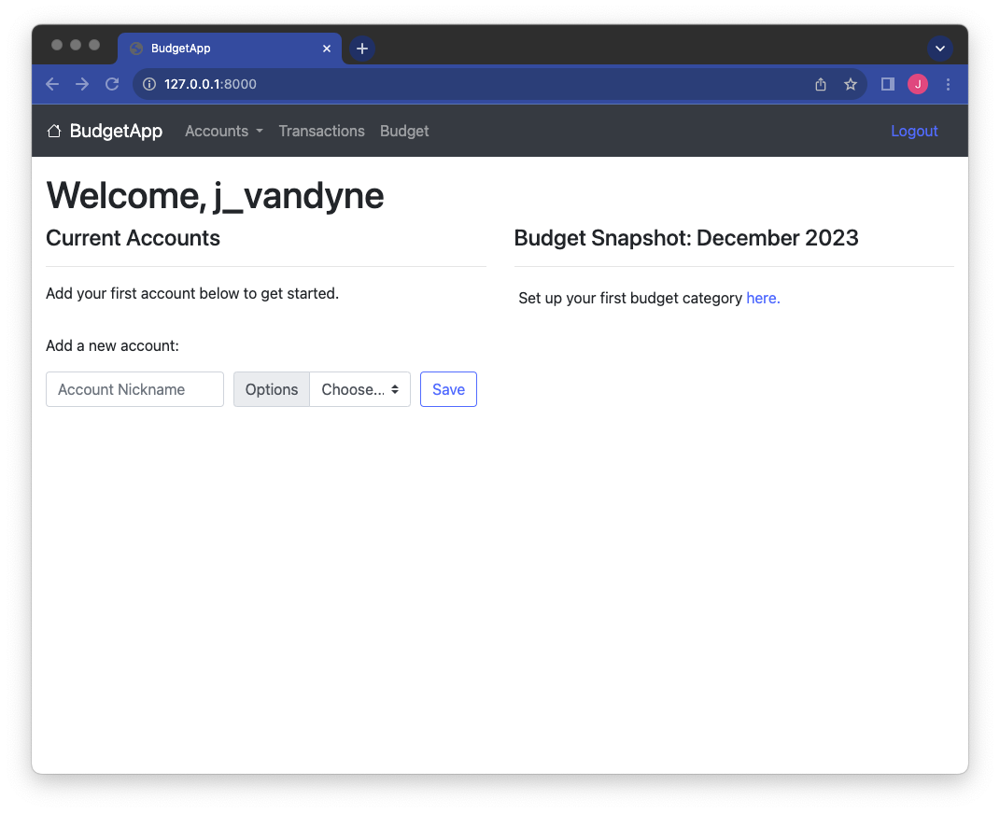
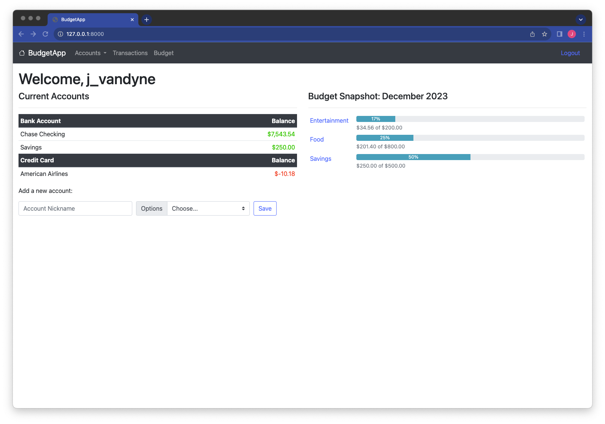
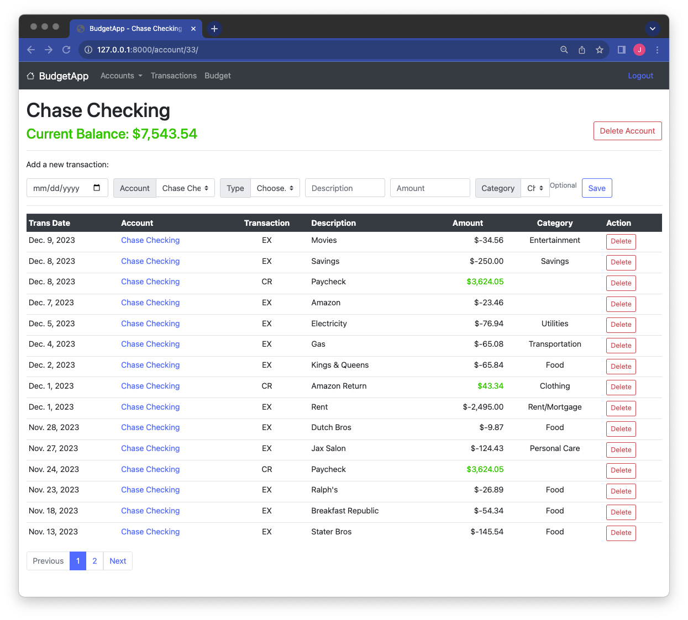
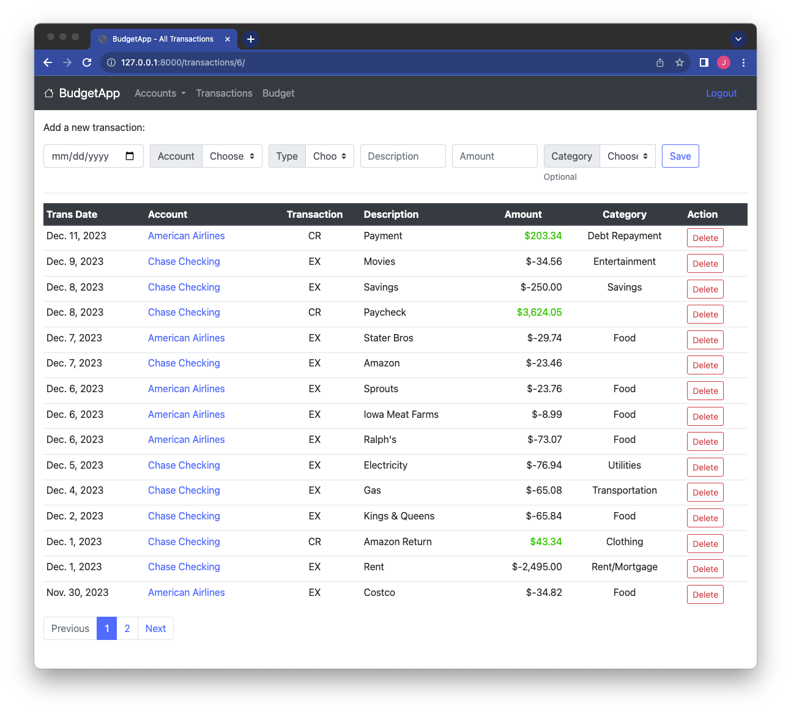
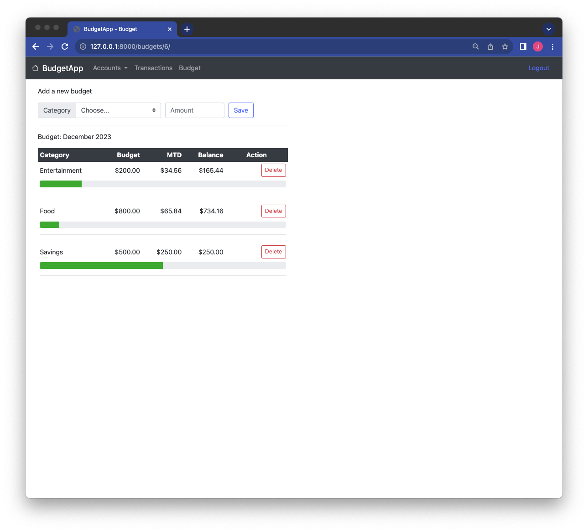

# Budget App
A web app for tracking expenses and budgets. 

## Languages & Framework
___
- Python
- HTML/CSS
- Django
- Bootstrap

## Screenshots
___
### New Account Home Page

### Home Page

### Account Page

### Transactions Page

### Budget Page

## Continuing Work
___
- Edit feature
    - Accounts
    - Transactions
    - Budget
- Retrieve password
- Reset pasword
- Filter transactions
- Filter budget (MM/YY)
- Connect corresponding transactions to budget table
